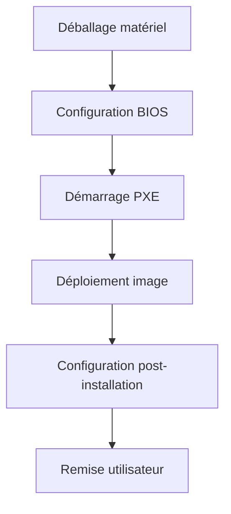
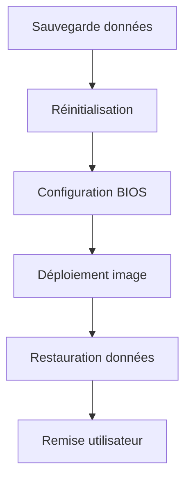
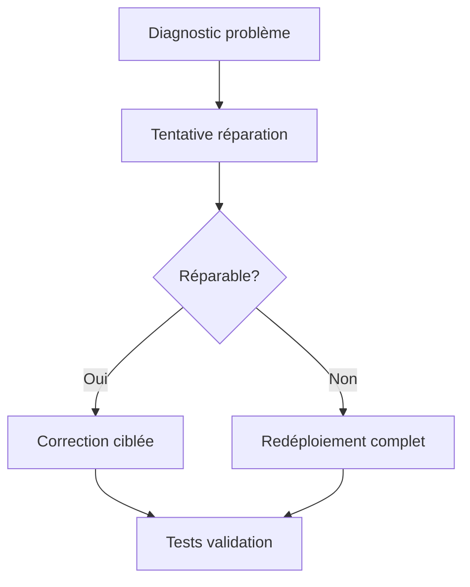

# Guide d'implémentation d'un système de déploiement Windows Master/MDT @ Oodrive

## Sommaire
1. [Introduction](#introduction)
2. [Architecture technique](#architecture-technique)
3. [Configuration du Master Windows](#configuration-du-master-windows)
4. [Configuration du serveur MDT](#configuration-du-serveur-mdt)
5. [Processus de maintenance](#processus-de-maintenance)
6. [Déploiement des images](#déploiement-des-images)
7. [Intégration Active Directory](#intégration-active-directory)
8. [Cas pratiques de déploiement](#cas-pratiques-de-déploiement)
9. [Considérations de sécurité](#considérations-de-sécurité)

## Introduction

Ce document présente la mise en œuvre d'une solution de déploiement d'images Windows basée sur l'approche Master/MDT (Microsoft Deployment Toolkit) pour standardiser les postes de travail et optimiser leur déploiement au sein de l'entreprise Oodrive.

### Contexte actuel
L'entreprise fait face à plusieurs problématiques liées au déploiement manuel des postes de travail :
- Temps d'installation excessif par poste
- Hétérogénéité des configurations
- Maintenance et mises à jour complexes
- Gestion inefficace des logiciels et configurations spécifiques

### Objectifs
- Standardiser l'environnement de travail
- Réduire le temps de déploiement
- Simplifier la maintenance et les mises à jour
- Garantir la sécurité et la conformité 
- Faciliter l'intégration des nouveaux collaborateurs

### Contraintes
- Respect des normes de sécurité de l'entreprise
- Compatibilité avec l'infrastructure existante
- Nécessité de mises à jour régulières
- Intégration avec l'infrastructure Active Directory existante

## Architecture technique

### Vue d'ensemble
L'infrastructure repose sur une architecture Master/MDT permettant de créer et déployer des images standardisées sur les postes de travail via un serveur centralisé.

### Composants principaux

#### Serveur Master (Proxmox)
- **Rôle** : Hébergement de la VM Master Windows
- **Configuration** :
  - Système : Proxmox VE
  - Ressources VM Master : 4 cœurs CPU, 8 Go RAM, 100 Go stockage

#### Machine virtuelle Master
- **Système** : Windows 10/11 Professionnel
- **Configuration** :
  - Certificats WiFi liés à l'Active Directory
  - Firefox comme navigateur par défaut
  - Suite Microsoft Office complète
  - Logiciels standards de l'entreprise

#### Serveur de déploiement MDT
- **Système** : Windows Server avec rôles MDT et WDS
- **Fonctions** :
  - Réception des images Master après mise à jour
  - Gestion du déploiement vers les postes clients
  - Configuration automatique selon les règles définies

#### Outils principaux
- **Chocolatey (Choco)** : Gestionnaire de paquets Windows pour l'installation et les mises à jour
- **WinSCP** : Outil de transfert sécurisé pour les images Master
- **MDT** : Solution de déploiement des images
- **PXE** : Environnement d'exécution de préamorçage pour le déploiement réseau

### Schéma d'infrastructure
```
┌─────────────────┐      ┌─────────────────┐      ┌─────────────────┐
│                 │      │                 │      │                 │
│  Serveur Master │      │ Serveur MDT/WDS │      │  Active         │
│  (Proxmox)      │──────│  Déploiement    │──────│  Directory      │
│                 │      │                 │      │                 │
└─────────────────┘      └─────────────────┘      └─────────────────┘
                                  │
                                  │
                                  ▼
                         ┌─────────────────┐
                         │                 │
                         │  Infrastructure │
                         │  Réseau PXE     │
                         │                 │
                         └─────────────────┘
                                  │
                                  │
            ┌───────────┬─────────┴──────────┬───────────┐
            │           │                    │           │
┌───────────▼───┐ ┌─────▼─────────┐  ┌───────▼───┐ ┌─────▼─────────┐
│             │ │               │  │           │ │               │
│ Poste       │ │ Poste         │  │ Poste     │ │ Poste         │
│ Client 1    │ │ Client 2      │  │ Client 3  │ │ Client 4      │
│             │ │               │  │           │ │               │
└─────────────┘ └───────────────┘  └───────────┘ └───────────────┘
```

## Configuration du Master Windows

### Préparation de l'environnement
1. **Installation de la VM Master sous Proxmox**
   - Création de la VM avec allocation des ressources requises
   - Installation de Windows 10/11 Professionnel

2. **Configuration initiale du système**
   - Paramétrage du réseau
   - Installation des pilotes spécifiques
   - Application des mises à jour Windows

### Installation des logiciels standards
1. **Mise en place de Chocolatey**
   ```powershell
   Set-ExecutionPolicy Bypass -Scope Process -Force
   iex ((New-Object System.Net.WebClient).DownloadString('https://chocolatey.org/install.ps1'))
   ```

2. **Installation des logiciels via Chocolatey**
   ```powershell
   choco install firefox office365proplus adobereader 7zip -y
   ```

3. **Installation des utilitaires spécifiques**
   - Intégration des outils internes
   - Déploiement des certificats WiFi
   - Configuration des politiques de sécurité

### Configurations spécifiques
- **Paramètres réseau** pour l'intégration Active Directory
- **Sécurité** selon les politiques de l'entreprise
- **Configuration utilisateur par défaut**
- **Personnalisation de l'interface**

## Configuration du serveur MDT

### Installation du serveur MDT
1. **Prérequis**
   - Windows Server avec interface graphique
   - Accès réseau aux postes clients
   - Droits d'administration sur le domaine

2. **Installation des composants**
   - Installation de Windows ADK (Assessment and Deployment Kit)
   - Installation de MDT (Microsoft Deployment Toolkit)
   - Configuration du rôle WDS (Windows Deployment Services)

3. **Configuration de la base MDT**
   ```powershell
   New-Item -Path "C:\DeploymentShare" -ItemType Directory
   Import-Module "C:\Program Files\Microsoft Deployment Toolkit\bin\MicrosoftDeploymentToolkit.psd1"
   New-PSDrive -Name "DS" -PSProvider MDTProvider -Root "C:\DeploymentShare"
   ```

### Préparation du partage de déploiement
1. **Création du partage**
   - Définition des chemins d'accès
   - Configuration des droits d'accès

2. **Importation des pilotes**
   - Organisation par fabricant/modèle
   - Intégration des pilotes critiques (réseau, stockage)

3. **Importation des applications**
   - Création des packages d'application
   - Configuration des dépendances

4. **Création des séquences de tâches**
   - Configuration des séquences standard
   - Paramétrage des tâches automatisées

### Configuration du WDS pour PXE Boot
1. **Activation du service WDS**
   - Configuration des options PXE
   - Intégration avec DHCP existant

2. **Paramétrage des images d'amorçage**
   - Génération des images WinPE personnalisées
   - Configuration des options de démarrage

## Processus de maintenance

### Cycle de mise à jour mensuel
Le maintien à jour de l'image Master suit un processus mensuel rigoureux :

1. **Préparation**
   - Démarrage de la VM Master sur Proxmox
   - Vérification et sauvegarde de l'image actuelle

2. **Mise à jour des logiciels**
   ```powershell
   choco upgrade all -y
   ```
   - Installation des nouveaux logiciels requis
   - Vérification des versions et compatibilité

3. **Mises à jour Windows**
   - Application des correctifs de sécurité
   - Installation des mises à jour cumulatives
   - Vérification de la stabilité post-mise à jour

4. **Optimisation du système**
   ```powershell
   # Nettoyage des fichiers temporaires
   Remove-Item -Path "$env:TEMP\*" -Recurse -Force
   # Défragmentation du disque
   Optimize-Volume -DriveLetter C -Defrag
   ```

5. **Préparation de l'image**
   - Exécution de Sysprep pour généraliser l'image
   ```cmd
   C:\Windows\System32\Sysprep\sysprep.exe /generalize /oobe /shutdown
   ```
   - Exportation de l'image depuis Proxmox

6. **Transfert vers MDT**
   - Utilisation de WinSCP pour le transfert sécurisé
   - Importation dans l'environnement MDT
   ```powershell
   Import-MDTOperatingSystem -Path "DS:\Operating Systems" -SourcePath "E:\Exports\Master" -DestinationFolder "Windows10-Master"
   ```

### Documentation et traçabilité
Chaque mise à jour est documentée précisément :
- Version de l'image et date
- Liste exhaustive des modifications
- Tests de validation effectués
- Problèmes rencontrés et solutions appliquées

## Déploiement des images

### Processus de déploiement

1. **Préparation du poste client**
   - Configuration du BIOS/UEFI :
     * Désactivation du Secure Boot
     * Activation de l'option PXE
     * Configuration de l'ordre de démarrage
   - Connexion au réseau via adaptateur Ethernet

2. **Démarrage en PXE**
   - Sélection du boot PXE au démarrage (généralement F12)
   - Connexion au serveur MDT
   - Authentification avec identifiants de déploiement
   - Sélection de la séquence de tâches appropriée

3. **Installation automatisée**
   - Partitionnement du disque selon le schéma prédéfini
   - Installation du système d'exploitation
   - Application des pilotes spécifiques au matériel
   - Installation des logiciels inclus dans l'image

4. **Configuration post-installation**
   - Intégration au domaine Active Directory
   - Application des stratégies de groupe (GPO)
   - Configuration des paramètres utilisateur
   - Exécution des scripts post-déploiement

### Scénarios de déploiement

#### Nouveau poste


#### Réaffectation de poste


#### Maintenance corrective


### Contrôle qualité
Chaque déploiement fait l'objet d'une vérification systématique :
- Installation complète des logiciels
- Connectivité réseau et Active Directory
- Validation des configurations spécifiques
- Contrôle des performances système

## Intégration Active Directory

### Configuration du contrôleur de domaine

Le déploiement s'appuie sur l'infrastructure Active Directory existante :

1. **Installation du rôle AD DS**
   ```powershell
   Install-WindowsFeature -Name AD-Domain-Services -IncludeManagementTools
   ```

2. **Promotion en contrôleur de domaine**
   ```powershell
   Install-ADDSForest -DomainName "domaine.local" -InstallDNS:$true
   ```

3. **Configuration DNS et DHCP**
   - Configuration des zones de recherche directe et inversée
   - Définition des étendues DHCP avec options nécessaires au PXE

### Stratégies de groupe (GPO)

1. **Création des GPO de base**
   - Stratégies de mot de passe
   - Configuration du bureau à distance
   - Paramètres de pare-feu

2. **GPO spécifiques au déploiement**
   - Restrictions d'accès utilisateur
   - Configuration des applications
   - Paramètres de sécurité

### Intégration des postes clients
1. **Jonction au domaine**
   ```powershell
   Add-Computer -DomainName "domaine.local" -Credential "DOMAINE\Admin" -Restart
   ```

2. **Application des stratégies**
   ```powershell
   gpupdate /force
   ```

## Cas pratiques de déploiement

### Déploiement de masse
Pour un déploiement simultané sur plusieurs machines :
1. Préparation d'un switch dédié au déploiement
2. Configuration des postes avec démarrage PXE
3. Lancement du déploiement avec sélection automatique
4. Supervision via la console MDT

### Déploiement avec personnalisation
Pour adapter l'image à des cas spécifiques :
1. Utilisation de profils de déploiement différenciés
2. Paramétrage des variables de séquence de tâches
3. Application de scripts post-installation spécifiques
4. Personnalisation via les réponses automatisées (fichiers XML)

### Débogage et résolution de problèmes
En cas d'échec de déploiement :
1. Consultation des journaux MDT (C:\DeploymentShare\Logs)
2. Analyse des erreurs spécifiques
3. Test en mode manuel ou verbeux
4. Correction des séquences de tâches problématiques

## Considérations de sécurité

### Sécurisation du processus
1. **Protection des images**
   - Stockage sécurisé des images Master
   - Chiffrement des données sensibles
   - Contrôle d'accès strict aux ressources MDT

2. **Authentification**
   - Utilisation d'identifiants spécifiques pour le déploiement
   - Séparation des privilèges administratifs
   - Rotation régulière des mots de passe

3. **Audit et traçabilité**
   - Journalisation de tous les déploiements
   - Suivi des modifications d'image
   - Rapports d'activité réguliers

### Mise en conformité
- Application des politiques de sécurité de l'entreprise
- Respect des exigences réglementaires (RGPD, etc.)
- Validation périodique par l'équipe sécurité

## Annexes

### Scripts utiles

#### Préparation Master pour capture
```powershell
# Nettoyage avant capture
Write-Host "Nettoyage du système avant capture"
Stop-Service -Name wuauserv
Remove-Item -Path C:\Windows\SoftwareDistribution\* -Recurse -Force
Remove-Item -Path C:\Windows\Temp\* -Recurse -Force
Clear-RecycleBin -Force
Optimize-Volume -DriveLetter C -Defrag

# Exécution de Sysprep
Write-Host "Exécution de Sysprep"
Start-Process -FilePath "C:\Windows\System32\Sysprep\sysprep.exe" -ArgumentList "/generalize /oobe /shutdown" -Wait
```

#### Configuration MDT automatisée
```powershell
# Import des modules MDT
Import-Module "C:\Program Files\Microsoft Deployment Toolkit\bin\MicrosoftDeploymentToolkit.psd1"

# Création du partage de déploiement
New-Item -Path "D:\DeploymentShare" -ItemType Directory -Force
New-SmbShare -Name "DeploymentShare$" -Path "D:\DeploymentShare" -FullAccess "Administrators"

# Création du point de déploiement MDT
New-PSDrive -Name "DS" -PSProvider MDTProvider -Root "D:\DeploymentShare"
New-Item -Path "DS:\Media" -Enable "True" -Name "MEDIA001" -Comments "Windows 10 Media" -Root "D:\DeploymentShare\Media"
New-Item -Path "DS:\OperatingSystems" -Enable "True" -Name "OS001" -Comments "Windows 10 Image"
```

### Matrice de compatibilité matérielle
| Fabricant | Modèle | BIOS/UEFI | Pilotes spécifiques | Remarques |
|-----------|--------|-----------|---------------------|-----------|
| Dell      | Latitude 5520 | UEFI | Interface réseau, Stockage | Compatible PXE |
| HP        | EliteBook 840 G8 | UEFI | Carte graphique, Wifi | Secure Boot à désactiver |
| Lenovo    | ThinkPad T14 | UEFI/Legacy | Touchpad, Audio | F12 pour boot menu |

### Calendrier de maintenance
| Semaine | Action | Responsable | Validation |
|---------|--------|-------------|------------|
| S1      | Mise à jour Windows | Admin système | Tests fonctionnels |
| S2      | Mise à jour logiciels | Support niveau 2 | Tests applications |
| S3      | Révision séquences | Admin MDT | Tests déploiement |
| S4      | Nouvelle capture | Admin système | Validation image |

---

Cette méthodologie permet d'assurer un déploiement fiable et homogène sur l'ensemble du parc informatique, tout en optimisant les ressources et le temps nécessaires à la mise en service des postes de travail. La solution proposée répond aux objectifs fixés en termes de standardisation, rapidité de déploiement et facilité de maintenance.
