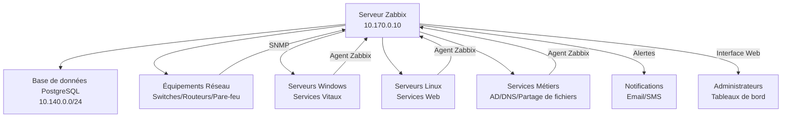

# BTS Services informatiques aux organisations SESSION 2022
## Épreuve E5 - Administration des systèmes et des réseaux (option SISR)
### ANNEXE 7-1-A : Fiche descriptive de réalisation professionnelle (recto)

| **DESCRIPTION D'UNE RÉALISATION PROFESSIONNELLE** | | **N° réalisation :** 01 |
|---|---|---|
| **Nom, prénom :** | | **N° candidat :** |
| **Épreuve ponctuelle** | **Contrôle en cours de formation** | **Date :** ../../.... |

| **Organisation support de la réalisation professionnelle** |
|---|
| Health North - Clinique de Guadeloupe |

| **Intitulé de la réalisation professionnelle** |
|---|
| Mise en place d'un système de supervision pour l'infrastructure informatique de Health North |

| **Période de réalisation :** Janvier - Mars 2022 | **Lieu :** Health North - Site Guadeloupe |
|---|---|
| **Modalité :** ☐ **Seul(e)** ☒ **En équipe** | |

| **Compétences travaillées** |
|---|
| Concevoir une solution d'infrastructure réseau |
| - A3.1.1 : Proposition d'une solution d'infrastructure |
| - A3.1.3 : Prise en compte du niveau de sécurité nécessaire à une infrastructure |
| - A5.2.4 : Étude d'une technologie, d'un composant, d'un outil ou d'une méthode |
| Installer, tester et déployer une solution d'infrastructure réseau |
| - A3.2.1 : Installation et configuration d'éléments d'infrastructure |
| - A3.2.3 : Mise à jour de la documentation technique d'une solution d'infrastructure |
| Exploiter, dépanner et superviser une solution d'infrastructure réseau |
| - A3.3.1 : Administration sur site ou à distance des éléments d'un réseau, de serveurs |
| - A3.3.5 : Gestion des indicateurs et des fichiers d'activité |
| - A5.2.2 : Veille technologique |

| **Conditions de réalisation (ressources fournies, résultats attendus)** |
|---|
| **Ressources fournies :** <br>- Cahier des charges pour la supervision de l'infrastructure<br>- Accès à l'infrastructure existante<br>- Serveur dédié à la solution de supervision<br>- Spécifications des équipements et services à superviser<br>- Documentation des VLANs et segments réseau<br><br>**Résultats attendus :**<br>- Un système de supervision Zabbix opérationnel<br>- Supervision de l'ensemble des équipements réseau et serveurs<br>- Alertes configurées pour les services critiques<br>- Cartographie réseau interactive<br>- Documentation technique complète |

| **Description des ressources documentaires, matérielles et logicielles utilisées** |
|---|
| **Ressources documentaires :**<br>- Documentation officielle Zabbix<br>- Schéma réseau de l'infrastructure Health North<br>- Procédures internes de supervision<br><br>**Ressources matérielles :**<br>- Serveur Ubuntu Server 22.04 LTS (4 vCPU, 8 Go RAM, 100 Go stockage)<br>- Infrastructure réseau existante (routeurs, switches, pare-feu)<br>- Serveurs et services à superviser<br><br>**Ressources logicielles :**<br>- Zabbix 6.0<br>- PostgreSQL 14<br>- Serveur web Apache 2.4 avec PHP 8.1<br>- Agents Zabbix pour différents systèmes d'exploitation |

| **Modalités d'accès aux productions et à leur documentation** |
|---|
| - Repository GitHub : https://github.com/[nom-utilisateur]/supervision-health-north<br>- Documentation complète disponible dans le répertoire /docs<br>- Scripts de déploiement dans le répertoire /scripts<br>- Templates et configurations dans le répertoire /config |

# BTS Services informatiques aux organisations SESSION 2022
## Épreuve E5 - Administration des systèmes et des réseaux (option SISR)
### ANNEXE 7-1-A : Fiche descriptive de réalisation professionnelle (verso)

## Descriptif de la réalisation professionnelle, y compris les productions réalisées et schémas explicatifs

### Contexte du projet

Dans le cadre de la refonte du système d'information de Health North suite à la fusion avec une entreprise d'hospitalisation privée, j'ai participé à la mise en place d'un système de supervision efficace basé sur Zabbix pour la clinique de Guadeloupe. Cette solution vise à surveiller en temps réel l'ensemble des équipements réseau et serveurs, détecter de façon proactive les incidents potentiels, et réduire le temps de résolution des problèmes.

### Architecture technique mise en place



### Démarche et réalisations

1. **Analyse des besoins et conception**
   - Étude de l'infrastructure existante et des services critiques
   - Définition des métriques et seuils d'alerte pertinents
   - Proposition d'une architecture de supervision adaptée
   - Sélection de Zabbix comme solution pour sa flexibilité et ses fonctionnalités

2. **Préparation de l'environnement**
   - Installation et configuration du serveur Zabbix sur Ubuntu Server 22.04
   - Configuration de PostgreSQL pour optimiser les performances
   - Sécurisation de l'infrastructure (pare-feu, fail2ban)
   - Configuration des accès réseau entre composants

3. **Déploiement**
   - Installation du serveur Zabbix et du frontend web
   - Déploiement des agents Zabbix sur les différents serveurs (script automatisé)
   - Configuration du monitoring SNMP pour les équipements réseau
   - Création de templates personnalisés pour les services spécifiques (AD, DHCP, DNS)

4. **Configuration avancée**
   - Création d'une structure logique de supervision adaptée à l'organisation
   - Mise en place de règles d'auto-découverte pour les segments réseau
   - Configuration des alertes et notifications par email
   - Élaboration d'une cartographie réseau interactive

5. **Documentation et formation**
   - Création d'une documentation technique complète
   - Formation des administrateurs système à l'utilisation de Zabbix
   - Élaboration de procédures de maintenance et de mise à jour
   - Rédaction de guides d'utilisation pour les équipes

### Extrait de configuration - Template Active Directory

```
Configuration → Templates → Create template

Nom: HN-Template-Active-Directory
Groupes: HN-GDLP-Serveurs, HN-GDLP-Services

Items à ajouter :
1. Service de réplication AD
   - Type: Agent Zabbix
   - Clé: service.info[NTDS]
   - Type d'information: Numérique (non signé)
   - Intervalle: 1m

2. Temps de réponse LDAP
   - Type: Simple check
   - Clé: net.tcp.service.perf[ldap,{HOST.CONN},389]
   - Type d'information: Temps de réponse en secondes
   - Intervalle: 1m

Déclencheurs:
1. Service AD arrêté
   - Nom: Service AD arrêté sur {HOST.NAME}
   - Expression: {HN-Template-Active-Directory:service.info[NTDS].last()}=0
   - Sévérité: High

2. Temps de réponse LDAP élevé
   - Nom: Temps de réponse LDAP > 1s sur {HOST.NAME}
   - Expression: {HN-Template-Active-Directory:net.tcp.service.perf[ldap,{HOST.CONN},389].avg(5m)}>1
   - Sévérité: Warning
```

### Résultats et bénéfices

- **Surveillance proactive** : Détection anticipée des problèmes potentiels avant qu'ils n'affectent les utilisateurs
- **Visibilité améliorée** : Vue d'ensemble de l'infrastructure via des tableaux de bord intuitifs
- **Temps de résolution réduit** : Identification rapide de la source des problèmes
- **Historisation des données** : Conservation des métriques pour analyse des tendances
- **Reporting automatisé** : Génération de rapports de disponibilité pour la direction

### Difficultés rencontrées et solutions apportées

- **Challenge** : Intégration avec les équipements existants utilisant différents protocoles
  **Solution** : Utilisation combinée d'agents Zabbix, de monitoring SNMP et de scripts personnalisés

- **Challenge** : Optimisation des performances pour une supervision à grande échelle
  **Solution** : Configuration fine de PostgreSQL et mise en place d'une politique de rétention des données

- **Challenge** : Sécurisation de la solution de supervision
  **Solution** : Configuration du pare-feu, implémentation de fail2ban et utilisation de communications cryptées

Cette réalisation m'a permis d'acquérir des compétences approfondies en matière de supervision d'infrastructure, de paramétrage avancé d'outils open source, et de gestion proactive des incidents informatiques dans un environnement critique de santé.
